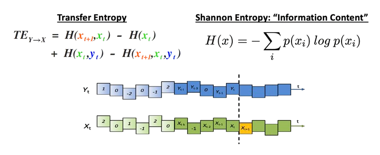

Here is a description of my GATE analysis. as a test, can I see this image?  I can see it! where does the text go next? Right below I suspect...yep! How about math? Can I drop this latex math here? $x = {-b \pm \sqrt{b^2-4ac} \over 2a}$

<!--more-->
